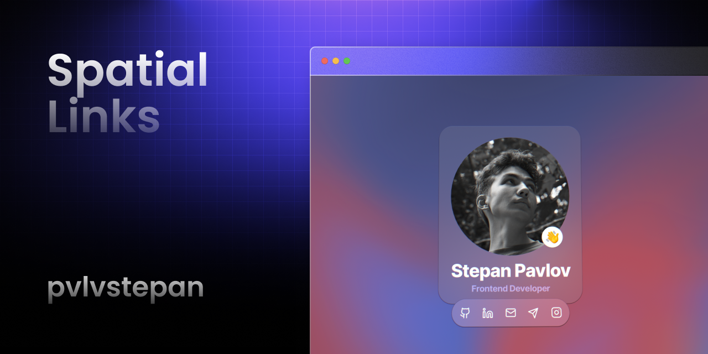

# Spatial Links




## Installation

To run MovieLister locally, follow these steps:

1. Clone the repository:

   ```bash
   git clone https://github.com/pvlvstepan/spatial-links.git
   cd spatial-links
   ```

2. Install dependencies (Yarn):

   ```bash
   yarn install
   ```

3. Start the development server:

   ```bash
   yarn dev
   ```

4. Open your web browser and navigate to `http://localhost:3000` to access the application.


## Technologies Used

- [Next.js](https://nextjs.org/)
- [Spline](https://spline.design/)
- [TailwindCSS](https://tailwindcss.com/)

## License

This project is licensed under the MIT License - see the [LICENSE](LICENSE) file for details.
